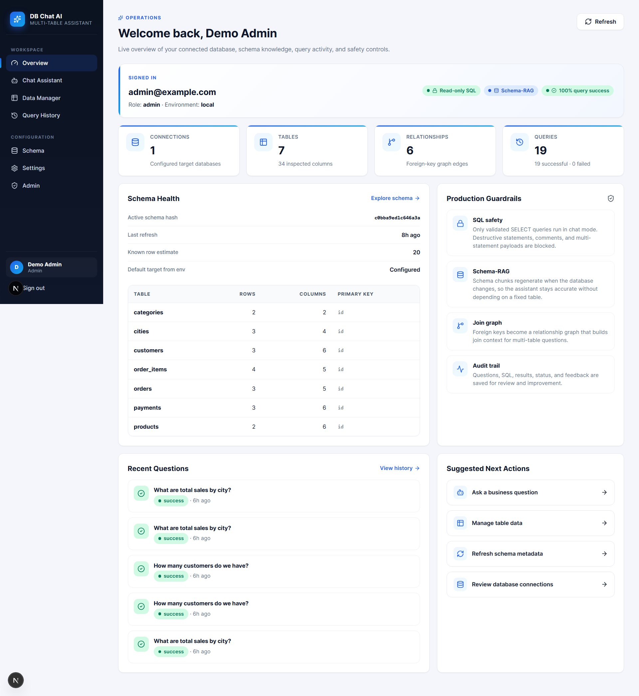
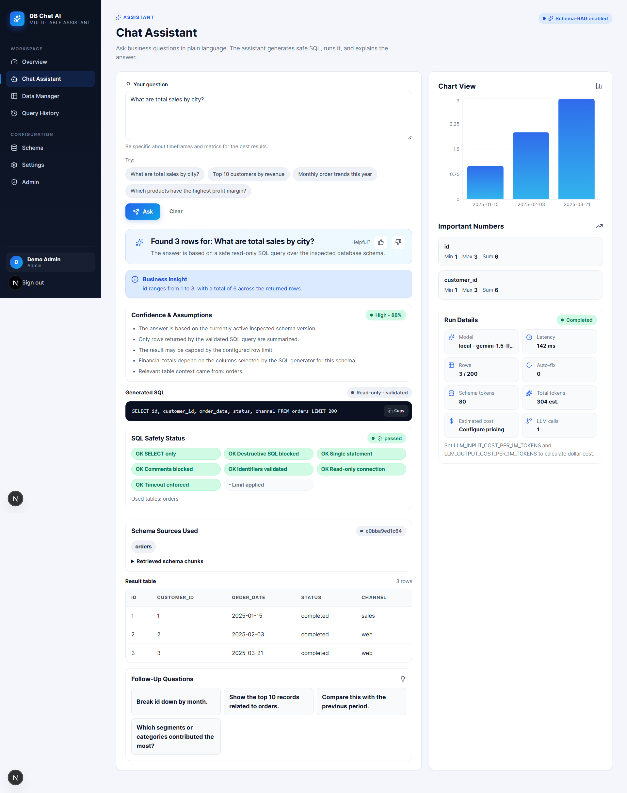
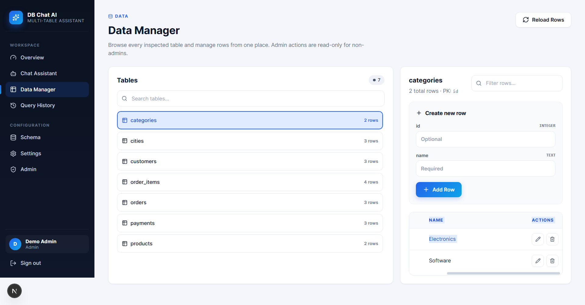
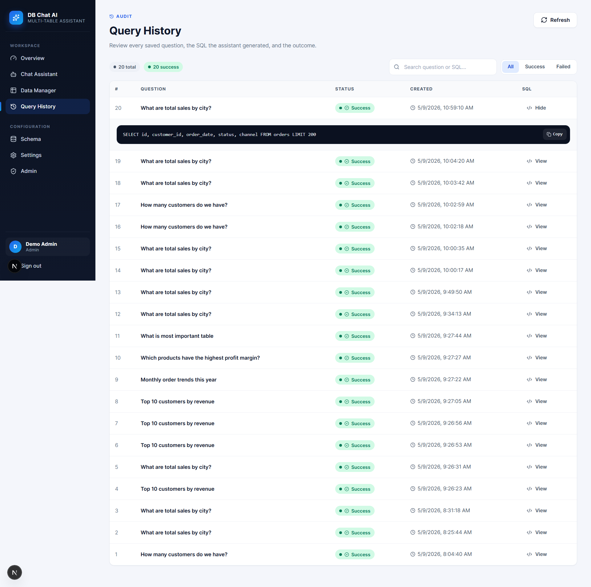
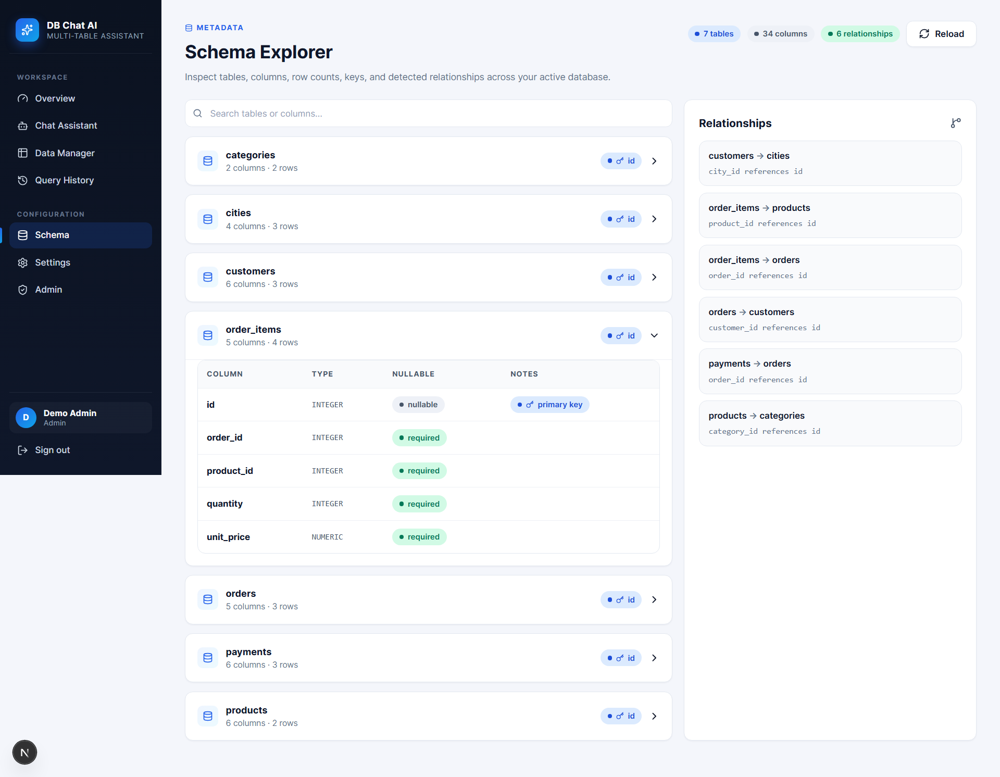
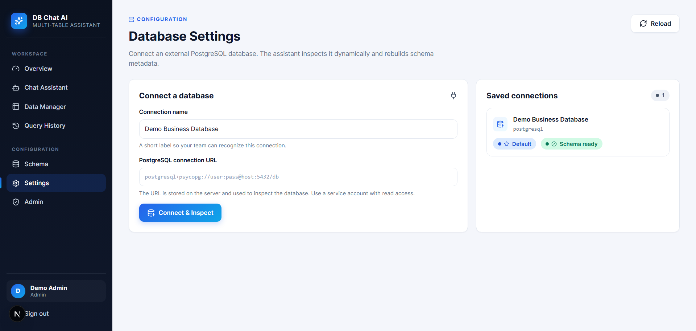
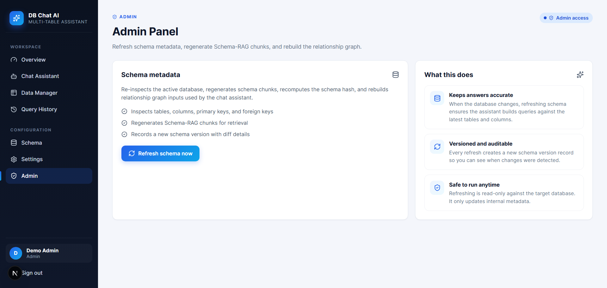

# DB Chat AI — Multi-Table Database Assistant

<p align="center">
  
  
  
  
  
  
  
  
</p>

<br/>

> **Ask plain-English questions about any relational database. Get safe, validated SQL, a human-readable answer, and an auto-generated chart — without writing a single line of SQL.**

<br/>

---

## Why I Built This

Every team I've worked with has the same problem: the data is in the database, but only one or two people can actually query it. Everyone else raises a Jira ticket or pings a data engineer and waits. Days pass. The answer is stale by the time it arrives.

I wanted a tool where a product manager or operations lead could open a browser tab, type *"Which cities had the most orders last quarter?"* and get an answer in under 10 seconds — with the SQL shown so anyone can verify it.

That's what this project is. It's not a chatbot that hallucinates. It inspects the real schema, builds a knowledge graph from actual foreign keys, validates every query before it runs, and shows you exactly what it did and why.

---

## Table of Contents

- [Live Preview](#live-preview)
- [Features at a Glance](#features-at-a-glance)
- [How It Works](#how-it-works)
- [System Architecture](#system-architecture)
- [AI / RAG Pipeline](#ai--rag-pipeline)
- [SQL Safety Layer](#sql-safety-layer)
- [Token Usage & Cost Tracking](#token-usage--cost-tracking)
- [Tech Stack](#tech-stack)
- [Database Design](#database-design)
- [Project Structure](#project-structure)
- [API Reference](#api-reference)
- [Installation — Local Dev](#installation--local-dev)
- [Installation — Docker Stack](#installation--docker-stack)
- [Environment Variables](#environment-variables)
- [Example Queries](#example-queries)
- [Screenshots](#screenshots)
- [Security](#security)
- [Running Tests](#running-tests)
- [Future Improvements](#future-improvements)
- [Challenges & Solutions](#challenges--solutions)
- [About the Author](#about-the-author)

---

## Live Preview

| Page | What you get |
|---|---|
| **Dashboard** | KPI cards, schema health, recent query activity, suggested next actions |
| **Chat Assistant** | Natural language → SQL → answer + chart + follow-up questions |
| **Data Manager** | Browse any table, add/edit/delete rows with inline forms |
| **Query History** | Every question, its SQL, status, and timestamp — filterable and searchable |
| **Schema Explorer** | Searchable accordion of tables, column types, PKs, FKs, and relationships |
| **Settings** | Connect any PostgreSQL or SQLite database without restarting |
| **Admin Panel** | Refresh schema embeddings, rebuild the relationship graph on demand |

---

## Features at a Glance

### 🤖 AI Core
- **Natural language → safe SQL** via Google Gemini (gemini-1.5-flash)
- **Schema-RAG**: schema is embedded into a vector store — only the relevant chunks are retrieved per question, keeping context small and accurate
- **FK-aware JOIN discovery**: a NetworkX graph built from real foreign keys computes the shortest JOIN path between any tables
- **Auto-fix retry**: if the generated SQL fails at runtime, the error is fed back to the LLM for one self-correction attempt
- **Smart chart selection**: bar chart, pie/donut, or plain table — chosen automatically based on result shape

### 🛡️ Safety & Trust
- SQL validator blocks all destructive operations before execution
- Every query gets a safety status breakdown (SELECT-only, identifiers validated, LIMIT enforced, read-only connection)
- Confidence score and assumptions list shown alongside every answer
- Schema sources displayed so users know exactly which tables were used

### 📊 Data & Workflow
- In-app data manager: browse, create, edit, and delete rows across any table
- Full query history with success/failure filter and SQL preview
- Schema explorer with searchable columns, types, nullable flags, and FK relationship map
- Connect any PostgreSQL or SQLite database through the Settings UI

### 🔐 Platform
- JWT authentication with three roles: `admin` / `analyst` / `viewer`
- Rate-limited login (10 attempts per IP per 60 seconds)
- Alembic migrations for the app database
- Docker Compose full stack with Nginx reverse proxy and SSL
- `/health` endpoint with live DB connectivity check and uptime counter

---

## How It Works

The flow from question to answer is deterministic and auditable. Here's what happens step by step when a user submits a question:

```
1. User types: "What are total sales by city?"

2. Schema Retrieval
   The question is embedded and used to search the vector store.
   Only the relevant schema chunks come back — tables, columns,
   sample values, and relationship summaries for orders and cities.

3. JOIN Path Discovery
   The relationship graph (built from real FKs) finds:
   cities → customers → orders → order_items
   This path is passed to the LLM as fact, not guesswork.

4. SQL Generation
   Gemini receives: schema context + JOIN path + question + safety rules.
   Output: SELECT cities.name, SUM(...) FROM orders JOIN ... GROUP BY ...

5. Safety Validation
   Pattern scan: no DROP / DELETE / UPDATE / INSERT detected ✓
   AST parse: all table and column names exist in schema ✓
   LIMIT: injected automatically if missing ✓

6. Execution
   Query runs against the business database.
   If it errors → LLM gets one retry with the error message.

7. Response
   Chart type selected (bar chart: text column + numeric column).
   Answer generated: "London leads with $48,200 in total sales..."
   Run details: model, latency, token counts, estimated cost.
   Follow-up questions suggested.
```

The user sees all of this — the SQL, the safety checks, the schema sources, the confidence level, and the cost. Nothing is hidden.

---

## System Architecture

```
┌────────────────────────────────────────────────────────────────────┐
│                         Browser — Next.js 16                       │
│                                                                    │
│   Dashboard  │  Chat Assistant  │  Data Manager  │  Query History │
│   Schema     │  Settings        │  Admin Panel                    │
└──────────────────────────────┬─────────────────────────────────────┘
                               │  HTTP / WebSocket
                        [ Nginx — SSL ]
                               │
┌──────────────────────────────▼─────────────────────────────────────┐
│                        FastAPI Backend                             │
│                                                                    │
│  ┌─────────────┐  ┌───────────────────────┐  ┌─────────────────┐  │
│  │  Auth (JWT) │  │     Schema RAG         │  │   SQL Agent     │  │
│  │  RBAC roles │  │  Inspector → Chunker   │  │  LLM (Gemini)  │  │
│  │  Rate limit │  │  Embedder → Retriever  │  │  Validator      │  │
│  └─────────────┘  └──────────┬────────────┘  │  Executor       │  │
│                              │               │  Auto-fix retry  │  │
│  ┌─────────────┐    ┌────────▼──────────┐    └────────┬────────┘  │
│  │  Response   │    │   Vector Store    │             │           │
│  │  Generator  │    │ (ChromaDB/Qdrant) │    ┌────────▼────────┐  │
│  │  Charts     │    └───────────────────┘    │  Relationship   │  │
│  │  Metadata   │                             │  Graph (NetworkX│  │
│  └─────────────┘                             │  FK shortest    │  │
│                                              │  path JOIN)     │  │
│  ┌──────────────────────┐                    └─────────────────┘  │
│  │  App DB              │                                         │
│  │  Users, History,     │                                         │
│  │  Connections         │                                         │
│  └──────────────────────┘                                         │
│  ┌──────────────────────┐                                         │
│  │  Business DB         │                                         │
│  │  (any SQLite or      │                                         │
│  │   PostgreSQL)        │                                         │
│  └──────────────────────┘                                         │
└────────────────────────────────────────────────────────────────────┘
```

Two databases run side by side on purpose. The **app database** owns users, query history, and connection metadata. The **business database** is whatever the user connects — it can be swapped at runtime through the Settings page without restarting the server.

---

## AI / RAG Pipeline

Standard RAG just retrieves text. Schema-RAG retrieves structured knowledge about your database so the LLM understands not just column names but business meaning.

### Schema Indexing (done once, or on manual refresh)

The inspector walks the connected database and for every table builds **6 chunk types** that get embedded separately:

| Chunk Type | What's Inside |
|---|---|
| `table_summary` | Table name, row count, inferred purpose |
| `column_summary` | All columns with data types, nullable flags, defaults |
| `sample_value_summary` | Actual sample values from top rows (so the LLM knows `status = 'pending'`, not `1`) |
| `business_meaning_summary` | Plain-English description of what the table represents |
| `example_question_mapping` | Illustrative questions this table is useful for answering |
| `relationship_summary` | FK edges and what they connect |

These chunks are embedded with Google `text-embedding-004` and stored in ChromaDB (local dev) or Qdrant (production).

### Query Time Retrieval

When a question comes in:
1. The question is embedded
2. Vector similarity search returns the most relevant chunks (typically 4–8)
3. Only those chunks are included in the LLM prompt — keeping token usage low and precision high

### FK-Aware JOIN Discovery

Before the LLM sees anything, the system builds a NetworkX undirected graph where nodes are tables and edges are foreign keys. `nx.shortest_path()` finds the JOIN chain between any two tables. This path is injected into the prompt as ground truth so the LLM doesn't have to guess relationships.

---

## SQL Safety Layer

Every query goes through two stages before execution. If either fails, the query is rejected — no exceptions.

**Stage 1 — Pattern scan**
Regex blocks: `DROP`, `DELETE`, `UPDATE`, `INSERT`, `ALTER`, `TRUNCATE`, `CREATE`, inline comments (`--`), block comments (`/* */`), and multi-statement separators (`;` mid-query).

**Stage 2 — AST validation**
The query is parsed with `sqlglot` into an abstract syntax tree. Every table name and column identifier is checked against the actual schema. Names that don't exist in the database are rejected.

**LIMIT enforcement**
If the query has no LIMIT, one is injected (default: 100 rows). If the LIMIT exceeds 500, it's capped. This prevents accidental full-table scans.

The user sees the result of each check in the UI as a row of status badges:

```
✅ SELECT only    ✅ Destructive SQL blocked    ✅ Single statement
✅ Comments blocked    ✅ SQL identifiers validated    ✅ Limit applied
✅ Read-only connection    ✅ Timeout enforced
```

---

## Token Usage & Cost Tracking

Every response includes a **Run Details** panel showing:

| Field | Description |
|---|---|
| **Model** | Which LLM was used (e.g. `gemini-1.5-flash`) |
| **Latency** | End-to-end response time in milliseconds |
| **Rows** | Returned rows vs. the applied row cap (e.g. `3 / 200`) |
| **Auto-fix** | Number of retry attempts (0 or 1) |
| **Schema tokens** | Tokens used by retrieved schema chunks |
| **Total tokens (est.)** | Full estimated prompt + completion token count |
| **Estimated cost** | Calculated from token counts using configured pricing |

Cost tracking is opt-in — set your per-token pricing in the admin panel and every query shows a dollar estimate. This makes it easy to understand API spend before it shows up on your bill.

---

## Tech Stack

| Layer | Technology | Notes |
|---|---|---|
| **Frontend** | Next.js 16 (App Router) + React 19 + TypeScript | File-based routing, server components |
| **Styling** | CSS custom properties (no Tailwind) | Design token system, full control |
| **Charts** | Recharts + Lucide React | Gradient fills, composable chart API |
| **Backend** | FastAPI (Python 3.11) | Async, Pydantic v2 validation, auto-docs |
| **ORM** | SQLAlchemy 2.0 (Mapped syntax) | Modern typed models, Alembic support |
| **Auth** | python-jose (JWT) + bcrypt | Stateless, role-based, rate-limited |
| **LLM** | Google Gemini `gemini-1.5-flash` | OpenAI fallback available |
| **Embeddings** | Google `text-embedding-004` | Same API key, high-quality dense vectors |
| **Vector Store** | ChromaDB (dev) / Qdrant (prod) | Local-first, scalable production path |
| **Graph** | NetworkX | Shortest-path JOIN discovery via FK edges |
| **SQL Parser** | sqlglot | DB-agnostic AST for safety validation |
| **Migrations** | Alembic | Versioned schema for the app database |
| **Containers** | Docker Compose | One-command full stack |
| **Proxy** | Nginx | SSL termination, WebSocket support |

---

## Database Design

The sample business database has 7 tables that cover a realistic e-commerce scenario. The schema is intentionally FK-rich to demonstrate multi-table JOIN resolution.

```
cities ──────────── customers ──────────── orders
                                             │
                                    ┌────────┴────────┐
                               order_items         payments
                                    │
                               products ─────────── categories
```

| Table | Purpose |
|---|---|
| `cities` | City reference data — name, country, population |
| `customers` | Customer records with `city_id` FK |
| `categories` | Product category lookup |
| `products` | Products with price and `category_id` FK |
| `orders` | Order headers with status, date, `customer_id` FK |
| `order_items` | Line items with quantity, unit price, `order_id` + `product_id` FKs |
| `payments` | Payment records with method and amount, `order_id` FK |

A question like *"What payment method do customers from Paris prefer?"* spans 4 tables. The relationship graph resolves `payments → orders → customers → cities` automatically.

You can replace this with any PostgreSQL or SQLite database via the Settings page — the system re-inspects and re-embeds the new schema without any code changes.

---

## Project Structure

```
.
├── app/                          # FastAPI backend
│   ├── main.py                   # App factory, CORS, router mounts
│   ├── config.py                 # Pydantic Settings, env validation
│   ├── dependencies.py           # Auth & RBAC FastAPI dependencies
│   ├── db/session.py             # SQLAlchemy engine + session
│   ├── models/                   # ORM models (User, Connection, History)
│   ├── routes/
│   │   ├── auth.py               # Login + rate limiting
│   │   ├── chat.py               # /ask endpoint (main entry point)
│   │   ├── connections.py        # DB connection CRUD
│   │   ├── data.py               # Table browse + row CRUD
│   │   ├── history.py            # Query history + feedback
│   │   ├── schema.py             # Schema introspection endpoint
│   │   ├── admin.py              # Schema refresh + system stats
│   │   └── health.py             # Health check with DB probe
│   ├── schema_rag/
│   │   ├── inspector.py          # Dynamic schema introspection
│   │   ├── chunker.py            # 6-type chunk builder per table
│   │   ├── embedder.py           # Embed chunks → vector store
│   │   └── retriever.py          # Semantic search over chunks
│   ├── graph/
│   │   └── relationship_graph.py # NetworkX FK graph + JOIN paths
│   ├── sql_agent/
│   │   ├── llm.py                # Gemini client + fallback
│   │   ├── prompt.py             # Prompt templates
│   │   ├── validator.py          # Two-stage SQL safety check
│   │   └── executor.py           # Execute + auto-fix retry
│   ├── response/
│   │   ├── generator.py          # Chart selection + answer text
│   │   └── metadata.py           # Run details, confidence, follow-ups
│   └── tests/
│
├── frontend/                     # Next.js 16 App Router
│   ├── app/
│   │   ├── layout.tsx            # Root layout (Nav + ToastProvider)
│   │   ├── globals.css           # CSS design token system
│   │   ├── dashboard/page.tsx    # KPI overview + recent activity
│   │   ├── chat/page.tsx         # Main chat interface
│   │   ├── data/page.tsx         # Data manager (CRUD)
│   │   ├── history/page.tsx      # Query history + search
│   │   ├── schema/page.tsx       # Schema explorer (accordion)
│   │   ├── settings/page.tsx     # DB connection manager
│   │   └── admin/page.tsx        # Admin: schema refresh
│   └── components/
│       ├── Nav.tsx               # Sidebar + mobile drawer
│       └── ui/                   # Alert, Badge, ConfirmDialog,
│                                 # EmptyState, Skeleton, Toast
│
├── alembic/                      # App DB migrations
├── nginx/nginx.conf              # Reverse proxy + SSL config
├── sample_db/init.sql            # 7-table sample business schema
├── docker-compose.yml            # Dev stack
├── docker-compose.prod.yml       # Production overrides + Nginx
├── Dockerfile                    # Multi-stage API image
├── Makefile                      # Workflow shortcuts
├── requirements.txt
└── .env.example
```

---

## API Reference

Swagger UI: `http://localhost:8000/docs`

| Method | Endpoint | Role | Description |
|---|---|---|---|
| `POST` | `/auth/login` | Public | Get JWT token (rate limited: 10/60s) |
| `GET` | `/health` | Public | DB probe + uptime |
| `POST` | `/chat/ask` | Any | Submit a question |
| `GET` | `/connections` | Any | List saved DB connections |
| `POST` | `/connections` | Admin | Add a new connection |
| `DELETE` | `/connections/{id}` | Admin | Remove a connection |
| `GET` | `/data/tables` | Any | List tables in the active DB |
| `GET` | `/data/tables/{name}/rows` | Any | Paginated row fetch |
| `POST` | `/data/tables/{name}/rows` | Analyst | Insert a row |
| `PUT` | `/data/tables/{name}/rows/{pk}` | Analyst | Update a row |
| `DELETE` | `/data/tables/{name}/rows/{pk}` | Admin | Delete a row |
| `GET` | `/history` | Any | Query history (role-filtered) |
| `POST` | `/history/{id}/feedback` | Any | Thumbs up / down |
| `GET` | `/schema` | Any | Full schema introspection |
| `POST` | `/admin/refresh-schema` | Admin | Re-embed schema + rebuild graph |

---

## Installation — Local Dev

No Docker needed. Uses SQLite for both databases.

### Requirements
- Python 3.11+
- Node.js 18+
- Google Gemini API key — free tier available at [aistudio.google.com](https://aistudio.google.com)

### Steps

```bash
# 1. Clone
git clone https://github.com/asadozzaman/ai-multitable-chatbot.git
cd ai-multitable-chatbot

# 2. Python environment
python -m venv .venv
.venv\Scripts\activate          # Windows
# source .venv/bin/activate     # macOS / Linux
pip install -r requirements.txt

# 3. Environment
cp .env.example .env
# Open .env and set GEMINI_API_KEY

# 4. Database migrations
alembic upgrade head

# 5. Frontend
cd frontend && npm install && cd ..

# 6. Run (two terminals)
uvicorn app.main:app --reload --port 8000   # terminal 1
cd frontend && npm run dev                  # terminal 2
```

Open `http://localhost:3000` and log in with the credentials from your `.env` file.

---

## Installation — Docker Stack

Full stack: two Postgres databases, Qdrant, Nginx.

### Steps

```bash
# 1. Environment
cp .env.example .env
# Set GEMINI_API_KEY and generate a secure SECRET_KEY:
python -c "import secrets; print(secrets.token_hex(32))"

# 2. Start
docker compose up --build -d
docker compose logs -f api

# 3. Seed the sample business database
make seed

# 4. Open http://localhost:3000
```

### Production deployment

```bash
# Place your SSL certs
mkdir -p nginx/certs
cp cert.pem nginx/certs/cert.pem
cp key.pem nginx/certs/key.pem

# Update nginx/nginx.conf → replace yourdomain.com
# Update docker-compose.prod.yml → set NEXT_PUBLIC_API_BASE_URL

docker compose -f docker-compose.yml -f docker-compose.prod.yml up -d
```

---

## Environment Variables

| Variable | Default | Required | Description |
|---|---|---|---|
| `GEMINI_API_KEY` | — | ✅ | Google Gemini API key |
| `SECRET_KEY` | `dev-secret-change-me` | ✅ | JWT signing secret |
| `APP_ENV` | `local` | | `local` or `production` |
| `APP_DATABASE_URL` | `sqlite:///./app.db` | | App DB (users, history) |
| `BUSINESS_DATABASE_URL` | `sqlite:///./browser_business.db` | | Default business DB |
| `VECTOR_DB_TYPE` | `chroma` | | `chroma` or `qdrant` |
| `QDRANT_URL` | `http://localhost:6333` | | Qdrant endpoint |
| `LLM_PROVIDER` | `gemini` | | `gemini` or `openai` |
| `OPENAI_API_KEY` | — | | Required if using OpenAI |
| `ALLOWED_ORIGINS` | `http://localhost:3000` | | Comma-separated CORS origins |
| `ADMIN_EMAIL` | `admin@example.com` | | Initial admin email |
| `ADMIN_PASSWORD` | — | ✅ | Initial admin password |

> **Note:** The app will refuse to start if `SECRET_KEY` is left as the default in any non-local environment. This is intentional — it's the most common production security mistake.

---

## Example Queries

All of these work against the sample database out of the box:

| Question | Tables Involved | Output |
|---|---|---|
| What are total sales by city? | cities, customers, orders, order_items | Bar chart |
| Top 10 customers by revenue | customers, orders, order_items | Bar chart |
| Revenue breakdown by product category | categories, products, order_items | Pie chart |
| Monthly order trends this year | orders | Bar chart |
| Which products have the highest profit margin? | products, order_items | Table |
| What payment method is most popular? | payments | Pie chart |
| How many customers do we have? | customers | Number answer |
| Which products have never been ordered? | products, order_items | Table |

---

## Screenshots

### Dashboard — Overview & Schema Health
The home screen gives you a live snapshot of the connected database: how many tables were inspected, how many FK relationships were detected, total queries run, and success rate. The schema health panel shows the current schema hash (changes when the DB schema changes) and the production guardrails that are always active.



---

### Chat Assistant — Natural Language to SQL
Type any business question. The assistant generates SQL, executes it safely, and returns a chart, a plain-English answer, and a list of follow-up questions. The generated SQL and all safety check results are shown inline so you can verify exactly what ran.



---

### Data Manager — Full Table CRUD
Browse every table in the connected database. Admins can create, edit, and delete rows directly from the UI. Analysts get read and write access. Viewers are read-only. Role enforcement happens server-side.



---

### Query History — Audit Trail
Every question asked through the assistant is logged with its SQL, execution status, and timestamp. Filter by success or failure. Search across question text and SQL content. Copy any SQL with one click.



---

### Schema Explorer — Visual Schema Map
Explore the full database schema without leaving the app. Search by table or column name. Each table expands to show column types, nullable flags, and primary key markers. The right panel lists all detected FK relationships.



---

### Database Settings — Connect Any Database
Add a PostgreSQL or SQLite connection by name and URL. The system immediately inspects the schema, builds the embedding index, and marks it as "Schema ready." Switch between connections without restarting the server.



---

### Admin Panel — Schema Refresh
When the underlying database schema changes, hit "Refresh schema now." This re-inspects all tables, rebuilds the Schema-RAG embeddings, recomputes the FK relationship graph, and records a new schema version hash. The assistant's answers immediately reflect the updated structure.



---

## Security

**Two-stage SQL validation** — Pattern scan + AST parse. If the generated query contains any destructive keyword, references a table that doesn't exist, or triggers any safety rule, it's rejected before it reaches the database.

**LIMIT enforcement** — Every query gets a row cap. Missing LIMIT → one is injected. LIMIT > 500 → capped at 500. No accidental full-table scans.

**JWT + RBAC** — Three roles with server-side enforcement on every endpoint. Tokens are short-lived and validated on each request. Role escalation is not possible through the UI.

**Rate-limited login** — 10 attempts per IP per 60-second window. In-process counter (single instance). Swap the dict for Redis for multi-instance deployments.

**CORS lockdown** — `ALLOWED_ORIGINS` env var replaces the dev wildcard. The secret key validator blocks startup if the default key is used outside of local mode.

**Read-only by design** — The SQL agent uses a read-only database connection for query execution. Even if the safety validator were somehow bypassed, the connection itself can't write.

---

## Running Tests

```bash
# All tests
pytest -v

# Specific module
pytest app/tests/test_sql_safety_executor.py -v

# With coverage
pytest --cov=app --cov-report=term-missing
```

The test suite covers SQL safety (dangerous queries blocked, safe queries pass, LIMIT injection), schema RAG chunking and retrieval, auth token lifecycle, and the health endpoint.

---

## Future Improvements

These are the next things I'd work on, in rough priority order:

- **Streaming responses** — Stream LLM output token by token so the answer appears progressively instead of after a full round-trip
- **Redis rate limiting** — The current in-process counter doesn't survive restarts or scale horizontally
- **Query result caching** — Same question, same schema version → return cached result without hitting the LLM
- **CSV / Excel export** — One-click export of any query result for offline sharing
- **Scheduled reports** — Let users set up recurring queries delivered by email (weekly revenue summary, daily error rate)
- **Schema change detection** — Detect schema diffs automatically and prompt for a refresh instead of requiring a manual admin action
- **More LLM providers** — Anthropic Claude, Azure OpenAI, local models via Ollama
- **Slack / Teams integration** — Ask questions via slash command without opening the web UI

---

## Challenges & Solutions

**The LLM making up table relationships**
The first version let the LLM decide how to join tables. It hallucinated relationships that didn't exist and generated queries that failed silently. The fix was the NetworkX FK graph: the LLM receives the exact join path derived from real foreign keys and just has to use it. It no longer has to reason about relationships at all.

**Schema context was too broad**
Dumping the full schema into every prompt was easy to implement but expensive and imprecise — a question about revenue would pull in unrelated tables like `cities`. The 6-chunk-per-table design fixed this. `sample_value_summary` chunks were the key insight: the LLM needs to know that `status` holds the string `'pending'`, not the integer `1`.

**Safety validator blocking legitimate queries**
The first regex-only validator rejected valid SQL like `CASE WHEN` expressions and correlated subqueries because they triggered keyword patterns. Switching to `sqlglot` AST parsing let us distinguish between a `DELETE` keyword in a string literal and an actual DELETE statement.

**React key warnings in the history table**
Using `<>` fragment shorthand inside a `.map()` over table rows caused React to warn about missing keys on every page load, because the fragment shorthand can't accept a `key` prop. Fixed by importing `Fragment` from React and using `<Fragment key={row.id}>` explicitly.

**CORS wildcard in production**
The initial `allow_origins=["*"]` was fine for local development. For production, added `ALLOWED_ORIGINS` as a comma-separated env var with a startup validator that refuses to boot with the wildcard outside of local mode.

---

## About the Author

**Md. Asadozzaman**
Full-stack developer focused on AI-integrated applications, data tooling, and clean system design.

I built this to solve a real problem I kept seeing: valuable business data locked behind a SQL skill barrier. If you're working on something in this space or want to talk about the implementation, reach out.

- 📧 faysalcomputervision@gmail.com
- 🐙 [github.com/asadozzaman](https://github.com/asadozzaman)

---

## License

MIT — do whatever you want with it. Attribution appreciated but not required.

---

<p align="center">Made by Md. Asadozzaman &nbsp;·&nbsp; If this helped you, a ⭐ means a lot.</p>
